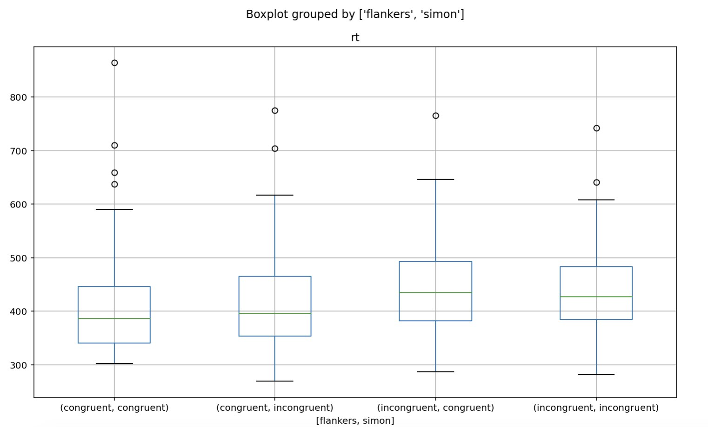
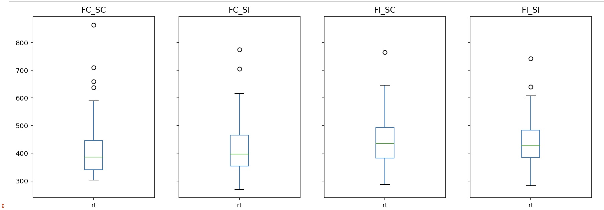

# Data Visualization
Below is a boxplot showing the distribution of reaction times for a dataset, grouped by the 'flankers' column.

```python
df.boxplot(column='rt', by='flankers')
```



The above code places both boxplots on the same axes, however it is alternatively possible to plot them on seperate subplots, as seen below:

```python
figure, axes = plt.subplots(1, 4, sharey=True, figsize=(15,5))
df['rt'].where((df['flankers']=='congruent') & (df['simon']=='congruent')).plot(ax=axes[0], kind='box', title='FC_SC')
df['rt'].where((df['flankers']=='congruent') & (df['simon']=='incongruent')).plot(ax=axes[1], kind='box', title='FC_SI')
df['rt'].where((df['flankers']=='incongruent') & (df['simon']=='congruent')).plot(ax=axes[2], kind='box', title='FI_SC')
df['rt'].where((df['flankers']=='incongruent') & (df['simon']=='incongruent')).plot(ax=axes[3], kind='box', title='FI_SI')
plt.show()
```


```python

```




```python

```

Both are vaild options; I have learned that the visualization you choose will change depending on the dataset, and what information you are trying to highlight.


