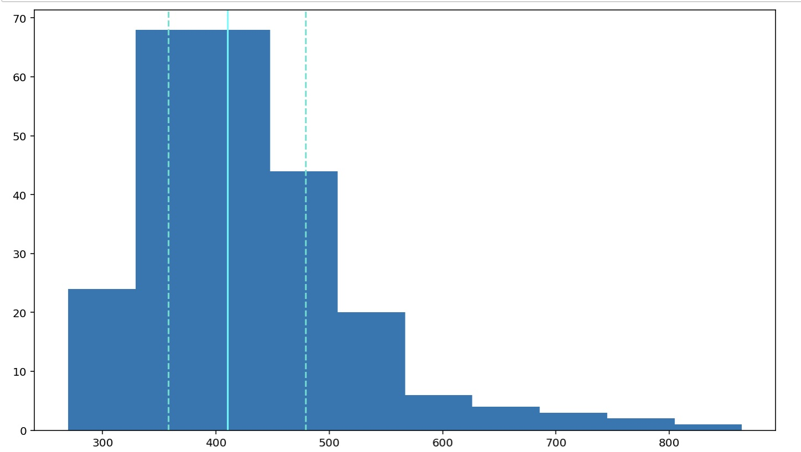

# Generating Histograms
This is an example of a histogram I generated, which plots the distribution of reaction times for an experiment.

```python
plt.hist(df['rt'])
plt.axvline(df['rt'].describe()['25%'], 0, 1, color='turquoise', linestyle='--')
plt.axvline(df['rt'].median(), 0, 1, color='cyan', linestyle='-')
plt.axvline(df['rt'].describe()['75%'], 0, 1, color='turquoise', linestyle='--')
plt.show()
```




```python

```
