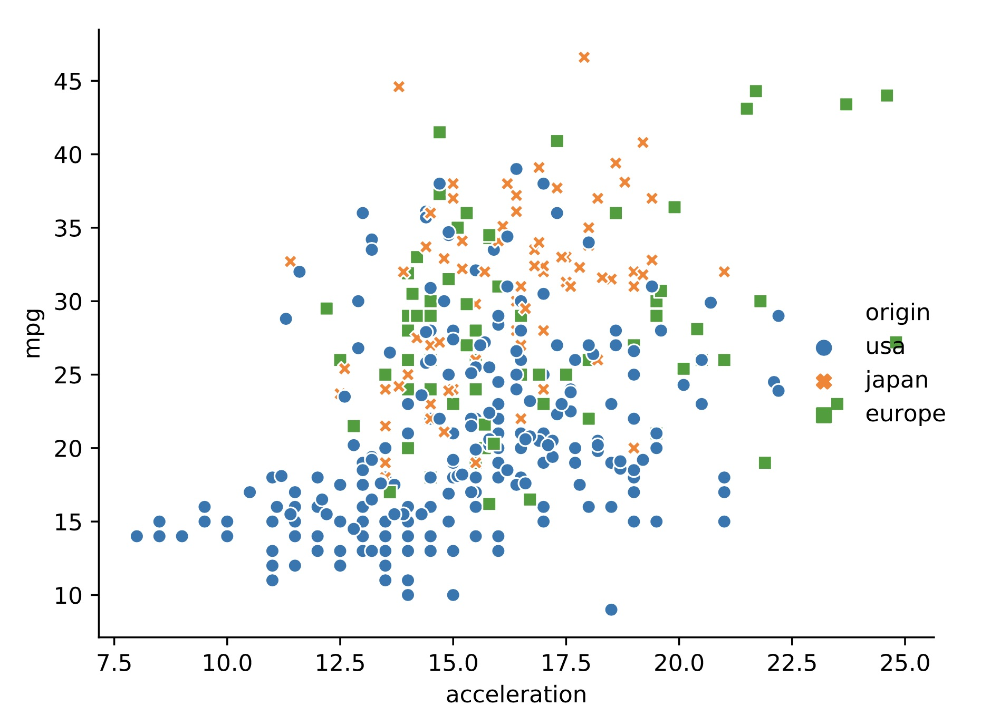

# Creating Plots with Seaborn
The following code is something I wrote as part of a datacamp exercise. It creates a scatterplot that shows the relationship between how fast a car can accelerate and its fuel efficiency. Country of origin is encoded by point style and colour.

```python
sns.relplot(x='acceleration', y='mpg', data=mpg, kind='scatter', style='origin', hue='origin')
plt.show()
```




```python

```


```python

```
